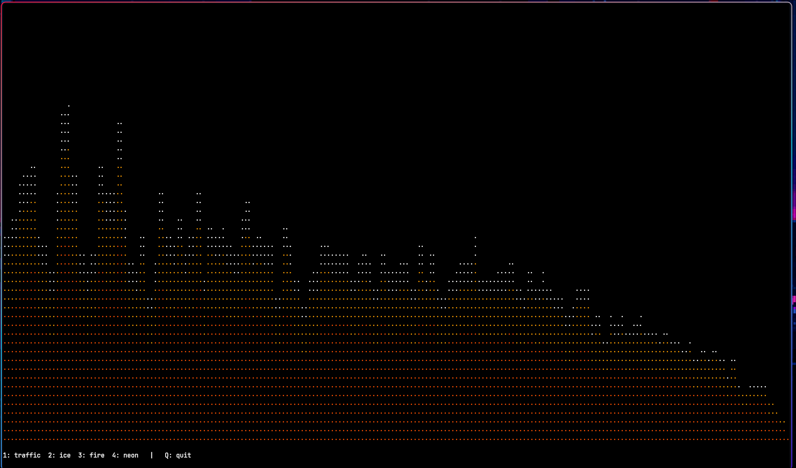
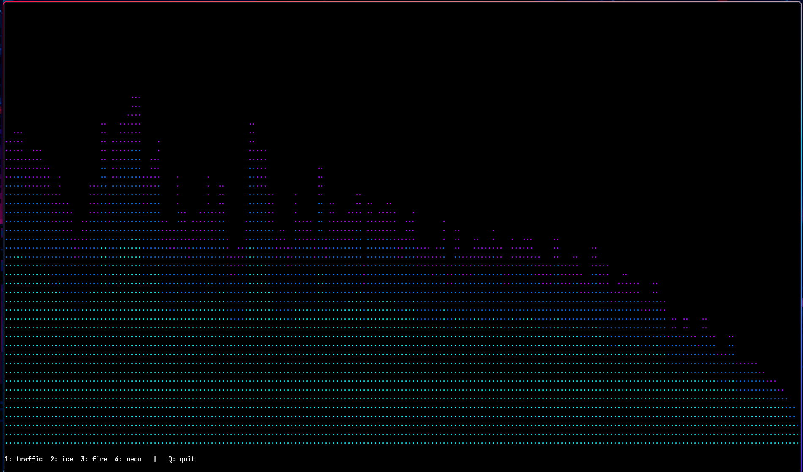
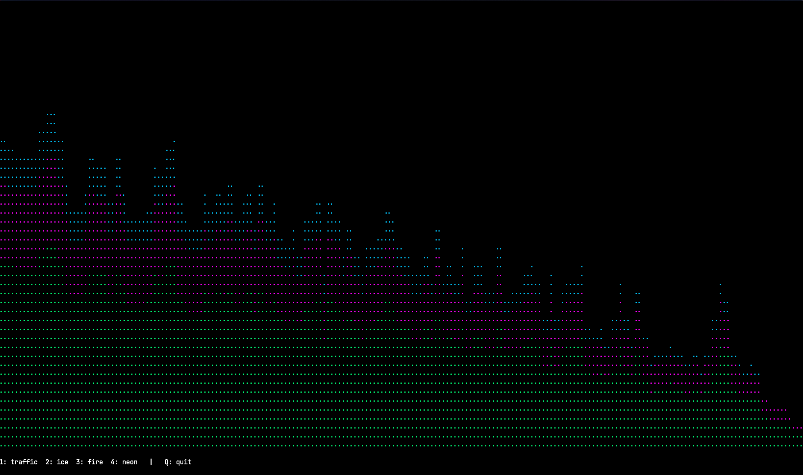

# Pix-Wave 

Pix-Wave is a **real-time terminal-based audio spectrum visualizer** that turns music into a **pixel-style frequency wave**.

It captures live system audio on Linux, analyzes it using **FFT**, and renders a smooth, animated **dot-matrix equalizer** directly in the terminal using **Textual + Rich**.

---

## Features

- Live system audio capture (PipeWire / PulseAudio)
- FFT-based frequency analysis
- Logarithmic frequency band scaling
- Retro **dot-matrix / pixel-style** visualization
- Multiple color themes:
  - Fire
  - Ice
  - Traffic Lights
  - Neon
- Smooth decay and motion
- Headroom + soft peak handling
- Fully configurable via `config.py`
- Runs entirely inside the terminal 

---

## Screenshots

### 🔥 Fire Theme


### ❄️ Ice Theme


### 🚦 Traffic Lights Theme


### 🌟 Neon Theme


---

## Configuration

All customization is done in **`config.py`**.

### Change color theme

```python
DEFAULT_THEME = "fire"   # fire | ice | traffic_lights | neon

DSP & visual tuning
```python
FFT_SIZE = 4096
LOW_FREQ = 300
HIGH_FREQ = 20000
GAIN = 0.35
DECAY = 0.85
```

No other files need editing.

---

## Running Pix-Wave

### Setup (first time only)
```bash
./setup.sh
```

This will:
- Create a virtual environment
- Activate it
- Install all dependencies

### Play some music
Pix-Wave listens to system audio, including:
- Spotify (app or web)
- YouTube / browser audio
- Any application producing sound

### Run
```bash
./run.sh
```


## Linux Audio Notes

- Designed specifically for **Linux**
- Uses **PipeWire** / **PulseAudio**
- Automatically detects:
  - Spotify
  - Browser audio (Chromium / Firefox)
  - Falls back to default system audio
- No manual audio routing required
this doesn't work for other oses
---


## Dependencies

- Python 3.8+
- PyAudio
- NumPy
- Textual
- Rich

---
